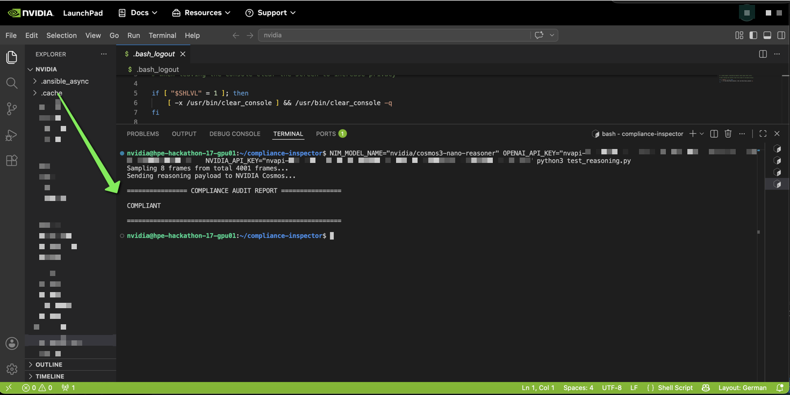
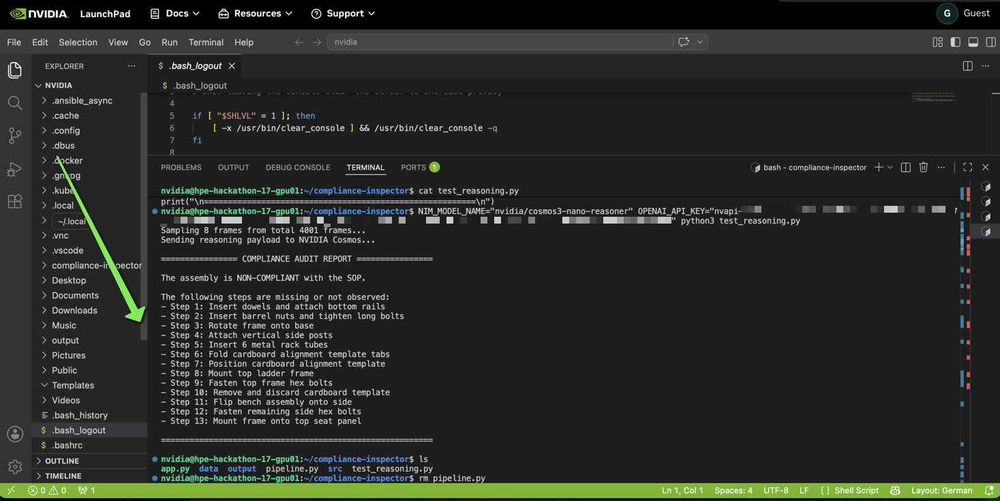

# Visual compliance inspector

A video-based compliance pipeline that uses NVIDIA AI models to verify whether assembly procedures were followed correctly, step by step. This means that when analyzing a video, the tool has to explore **temporal understanding (a successive sequence of steps) rather than treating the problem as simple image classification**.


## How it works

1. **Ingestion** — extracts one frame per second from an MP4 video (in our case, toy or furniture assembly videos)
2. **Cosmos Reasoner** — a vision AI model watches the frames and logs what it sees
3. **Audit Engine** — compares the observed actions against the SOP rules
4. **Nemotron 3.5** — an LLM reads the audit output and writes a natural language compliance report

---

## Main architecture considerations
**The tool is developed using exclusively NVIDIA tools and HPE-powered infrastructure.**

In a normal setup, to avoid memory collisions, one would deploy for example Nemotron (LLM) and Cosmos3 on different containers.

However, the current setup and code, as per `quick_demo.py` are running in a virtualized environment and talk to the model in the cloud. Cosmos was deployed in a containerized manner via docker, and employed for video processing and ingestion.

We used in this small demo the IKEA data sets because they were more accessible. Additionally, the videos are located at:
Stanford Digital Repository: https://purl.stanford.edu/sg200ps4374.


## Requirements and stack

- Python 3.12+.
- Docker with NVIDIA Container Runtime.
- An NGC API key from [catalog.ngc.nvidia.com](https://catalog.ngc.nvidia.com).
- NVIDIA GPU (tested on H100 NVL).
- Nemotron - which is a text-focused LLM used for RAG, agentic workflows, guardrails and LLM firewalls, etc.
- Comos 3 reasoner - for the sequential video ingestion and processing.

Install Python dependencies:
```
pip install openai opencv-python streamlit
```
### Models - information

**NVIDIA Cosmos 3 Reasoner 1.7.0**
- Type: multimodal vision-language model
- Architecture: transformer-based, designed for temporal video understanding
- Role in this project: processes sequential video frames and maps visual events to timestamps
- Deployment: NVIDIA NIM container (Docker), runs locally on GPU
- API format: OpenAI-compatible REST API

**NVIDIA Nemotron-3.5 Lightning 30B-A3B**
- Type: large language model
- Architecture: Mixture of Experts (MoE) — 30B total parameters, 3B active per inference
- Role in this project: reads Cosmos output and SOP rules, produces a natural language compliance report
- Deployment: NVIDIA hosted cloud API (`integrate.api.nvidia.com`)
- Notable feature: `enable_thinking` mode exposes the model's step-by-step reasoning alongside its final answer

### Hardware requirements to run these together: Cosmos 3 + Nemotron 3.5 Lightning

| Component | Minimum (Concurrent Execution) | Recommended (High-Volume) |
| :--- | :--- | :--- |
| **GPU** | NVIDIA Ampere, Hopper, or Blackwell | NVIDIA H100, H200, or B200 |
| **GPU VRAM** | 80 GB total (e.g., 1x A100/H100 80GB) | 160 GB+ (Multi-GPU setup) |
| **System RAM** | 64 GB | 128 GB+ |
| **Storage** | 500 GB NVMe SSD | 1 TB+ NVMe SSD |
| **CUDA** | 12.x | 12.x or 13.x |
| **Docker** | With NVIDIA Container Runtime | With NVIDIA Container Runtime |

** Sources:
1. [NIM for Cosmos Support Matrix](https://docs.nvidia.com/nim/cosmos/3.0.0/support-matrix.html)
2. [Nemotron-3.5 Lightning Model Card](https://build.nvidia.com/nvidia/nemotron-3.5-lightning-30b-a3b/modelcard)  

> [!NOTE]
> Used Nemotron-3.5 Lightning from NVIDIA's cloud infrastructure in this setup,
> so no dedicated GPU allocation was directly required for the LLM. Only for Cosmos setup was required the local GPU.

# Project architecture and calibration updates

This document outlines the recent architectural evolutions, changes, and prompt calibration adjustments made to the visual compliance inspection tool.

## 1. NemoClaw and OpenClaw integration
The architecture has been upgraded to utilize **NemoClaw** and **OpenClaw** for orchestration and reasoning. 
* **Integration**: These frameworks allow for dynamic, agentic reasoning (e.g., the LangChain interactive query agent) and secure communication with NVIDIA Cosmos and Nemotron models.
* **Security enhancements**: NemoClaw enforces network policies, strict sandbox boundaries, and secure API credential handling. This isolated, governed environment mitigates risks of unauthorized data exfiltration and arbitrary code execution.

## 2. Dynamic multi-video pipeline
**The system has evolved from a hardcoded binary assessment (compliant vs. non-compliant) to a robust, dynamic pipeline that processes multiple videos and separately handles their associated SOPs.**
* **End-to-end analysis**: The tool now accepts any properly named video (e.g., `video_Bench_tjusig.mp4`), automatically matches it to its corresponding SOP (`sop_tjusig.json`), and evaluates the footage from start to finish. This replaces the previous 8-frame sampling implementation, which was primarily an effective way to reduce the gap between app completeness and prototyping for mini-demos.
* **Objective determination**: Compliance is no longer assumed by the filename, which was previously a declarative statement (e.g., `full-compliant-video` is `OK: compliant`, `non-compliant-video` is `NON-compliant`). Now, the model acts as an objective inspector, determining pass or fail states purely based on the visual evidence extracted across the entire video.

## 3. Mechanisms to reduce hallucinations
For training purposes, various checks were run on different sample videos and SOP configurations. Comparing the full assembly video of one item with a trimmed video of the same item showed that Cosmos would incorrectly evaluate the trimmed video (with clearly missing steps) as `Compliant`.

In a default evaluation mode with no prior adjustments, it verified the existence of assembly steps while disregarding missing stages. Given the lack of memory between calls (each API call sent a single message array with one user message, lacking conversation history, session IDs, or threads), the model hallucinated.

To prevent the Cosmos vision model from producing false-positive results or assuming compliance based on existing data while ignoring missing building phases, three strict programmatic safeguards were introduced:

* **Per-chunk prompting**: Instead of providing the model with the entire video context at once, frames are batched into small chunks (e.g., 10 frames). The prompt dynamically injects the exact time window (e.g., 20.0s to 30.0s) and strictly restricts the model to report *only* what it observes in those specific frames.
* **Temporal filter**: A hard safety net in the code checks the timestamps of all reported actions. If the model claims an action occurred at a timestamp that exceeds the actual video duration, it is mechanically overridden to `detected: false`.
* **Completeness check**: A post-processing audit engine cross-references the model's reported observations against the expected SOP. If a step is never explicitly reported by the model, it is automatically marked as `MISSED`, resulting in an overall `FAIL`.

## 4. Calibration comparison and rule adjustments
Initial iterations of the prompt (based on the three code changes listed above) were calibrated too tightly, resulting in frequent "false fails" where perfectly compliant videos were flagged as non-compliant due to overly rigid instructions.

### Minimal calibration comparison
* **Strict calibration (previous)**: Resulted in a high false-fail rate. The model was punished for inferring completion, leading it to flag or dismiss certain steps even when visual evidence of the completed state was present.
* **Standardized calibration (current)**: Results in a natural, practical assessment. The model accurately passes compliant videos while still failing non-compliant videos via the completeness check and temporal filters.

### Deactivation of Rule 2 ("assembled state does not count"")
To achieve this standardized calibration, **Rule 2 ("Seeing the product in a certain assembled state does NOT count") was turned off.** 
* **Why it was removed**: Imposing this rule made the pipeline overly strict and rigid. In real-world video footage, an operator might obscure the camera during the exact moment of an action, but the subsequent frames clearly show the completed result (e.g., a bolt fully tightened). 
* By disabling this constraint, the pass filter behaves more naturally, allowing the model to accept clear visual evidence of a completed assembly step without triggering unjustified failures.
* **SOP cleanup**: We reduced the large number of visual cue indicators previously detailing each step of the process in the SOP files. These extra indicators had added reasoning friction and increased the number of tokens used. For a comparison of the old SOP model versus the current one, see below:
* data/sops/sop_tjusig.json
* assets/old_sop_tjusig.json

## Setup

Export and set globally on the environment the variables to later use and make them survive reboots/restarts:
```
echo 'export NGC_API_KEY="nvapi-xxxxxxxxxxxxxxxxxxxx"' >> ~/.bashrc
echo 'export NIM_BASE_URL="http://localhost:{your_port}/v1"' >> ~/.bashrc
echo 'export NIM_MODEL_NAME="nvidia/cosmos3-nano-reasoner"' >> ~/.bashrc
echo 'export NEMOTRON_BASE_URL="https://integrate.api.nvidia.com/v1"' >> ~/.bashrc
echo 'export NEMOTRON_MODEL_NAME="nvidia/nemotron-3.5-lightning-30b-a3b"' >> ~/.bashrc
```

To make these permanent across sessions, add them to `~/.bashrc` and after executing the above commands, run `source ~/.bashrc` to apply the changes.

## Running the pipeline

**Quick demo** (8 frames, fast, good for testing):
```
python3 quick_demo.py
```
To absolutely enforce execution in case of issues: make sure to cd in the directory where the source code is at (e.g. `cd compliance-inspector`) and re-inforce the env variables:
```
NIM_MODEL_NAME="nvidia/cosmos3-nano-reasoner" OPENAI_API_KEY=“nvapi-loooooooooongkey" NVIDIA_API_KEY="nvapi-nvapi-loooooooooongkey" python3 quick_demo.py 
```
To run the full demo
```
python3 quick_interactive_demo.py
```

**Full pipeline** (1fps, timestamped audit report). Same as the demo, it can require the API key and model initialization at forced execution if it can not read these from the environment:
```
python3 pipeline.py
```

**Dashboard** (view the report in a browser):
```
streamlit run app.py
```

## Project structure

```
compliance-inspector/
├── data/
│   ├── videos/          # videos to analyze
│   ├── sops/            # SOP JSON files
│   └── mocks/           # mock outputs for offline testing
├── src/
│   ├── ingestion.py     # frame extraction definition
│   ├── cosmos_client.py # Cosmos NIM API client
│   └── audit_engine.py  # deterministic SOP validator
├── output/              # generated reports (not committed to repo)
├── interactive_demo.py  # full end-to-end run
├── quick_demo.py        # lightweight 8-frame demo
└── app.py               # Streamlit dashboard
```
## Execution and mini-demo 

Here are 2 examples of outputs when running the demo from the CLI. Attention: in my example: `test_reasoning.py` corresponds to `quick_demo.py` in this project - it is the same code but the file on the testing environment had a different name.

Here are examples of 2 different outputs:

* Validation / Compliant



* Non-compliant:

