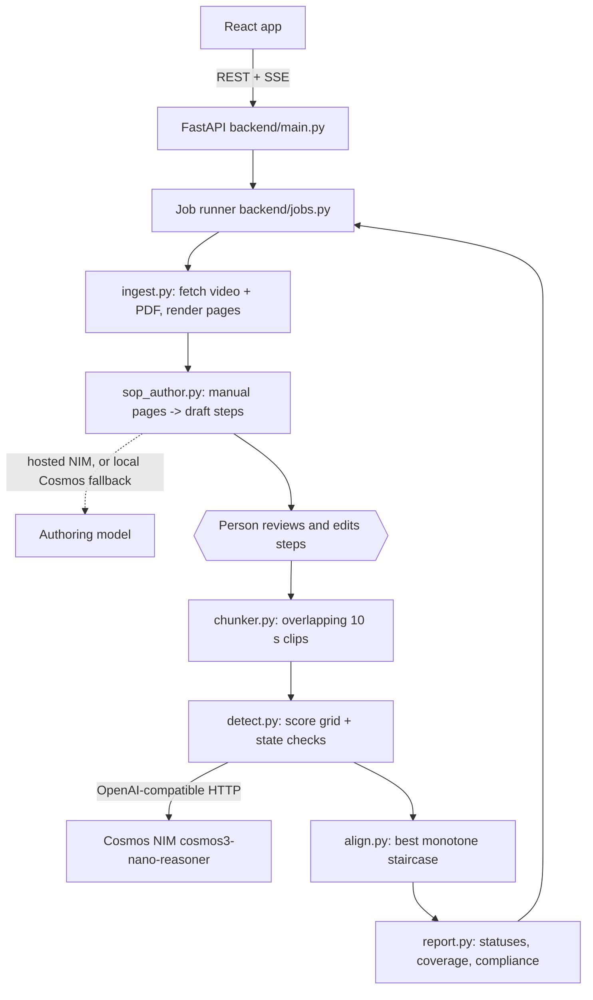

# Architecture: Visual Compliance Inspector

A web app: a React frontend over a FastAPI backend. The backend reads an instruction PDF into a
list of steps, lets a person correct them, then finds when each step happens in a video using the
Cosmos NIM.

## Flow of one job

1. **Ingest** (`ingest.py`). Download the video and PDF, or take uploads. User-supplied URLs are
   restricted to public http(s) addresses, re-checked on every redirect, so the server cannot be
   made to fetch from itself, its network, or cloud metadata. Render each PDF page to PNG.
2. **Author** (`sop_author.py`). Each page is read on its own ("which numbered steps are drawn
   here?"), then merged by printed step number; the page that produced a step becomes its
   `step_pages` entry. Uses the hosted model when `AUTHOR_API_KEY` is set, else the local Cosmos
   NIM, which writes noticeably weaker steps. Demo products skip this and load a hand-checked SOP.
3. **Review**. The job pauses at `awaiting_review`. The model leans heavily on step wording, so a
   person corrects the draft before any video is analysed. `PUT /api/jobs/{id}/sop` resumes.
4. **Detect** (`detect.py`), two independent signals:
   - *Action*: every clip is rated 0-10 against every step (`score_matrix`). A forced-choice
     variant (`choice_matrix`, one call per clip) exists and is selectable with `DETECT_MODE`.
   - *State*: each step's `completion_state` ("six tubes stand upright") is asked on ~16 frames
     sampled across the video, blank frames dropped, then fitted to the single false-to-true
     switch that disagrees with the fewest answers. Steps marked `state_is_monotone: false` skip it.
5. **Align** (`align.py`). A dynamic program picks the highest-scoring staircase through the grid:
   chunks map to steps in non-decreasing order, skipping a step costs `SKIP_PENALTY`. This replaced
   the notebook's greedy pointer, which could never recover from one wrong "yes".
6. **Report** (`report.py`). Statuses: `verified` (both signals), `likely` (one), `out_of_order`
   (a strong match outside the manual order), `unclear` (only a weak, unplaceable match),
   `not_observed`. Two numbers: coverage (steps with usable evidence) and compliance (of those,
   done correctly and in order). Unclear and not-observed count towards neither.

Jobs run on a thread pool and persist as `outputs/jobs/<id>/job.json`. Events go to the browser over
SSE (`snapshot` on connect, then `status`, `progress`, `chunks`, `row`, `report`), so the timeline
fills in while scoring runs. A restart marks in-flight jobs as failed.

## Measured accuracy (read before trusting output)

Measured with `tools/evaluate.py` against human timestamps on the two demo videos, cosmos3-nano:

| Approach | TJUSIG mean IoU | APPLARO mean IoU | Missed-step verdicts |
| --- | --- | --- | --- |
| Notebook greedy checker (baseline) | 0.00 | – | no better than "all done" |
| Grid + staircase (default) | 0.12 | 0.34 | no better than "all done" |
| Forced choice | 0.10 | 0.04 | mixed |

- Step placement improved; judging which steps were missed did not.
- The state signal is precise when it fires (within 1 s once) but rarely fires.
- Results are not stable: at temperature 0, about a quarter of grid ratings change between
  identical runs, and 5 of 13 TJUSIG statuses flipped across three runs.
- Two labelled videos is too few to tune thresholds without overfitting.

The limit appears to be the model, not the pipeline. A larger Cosmos size is the obvious next test.

## Legacy

`app.py` and `src/` are the original Streamlit starter, superseded by `backend/` and `frontend/`.
