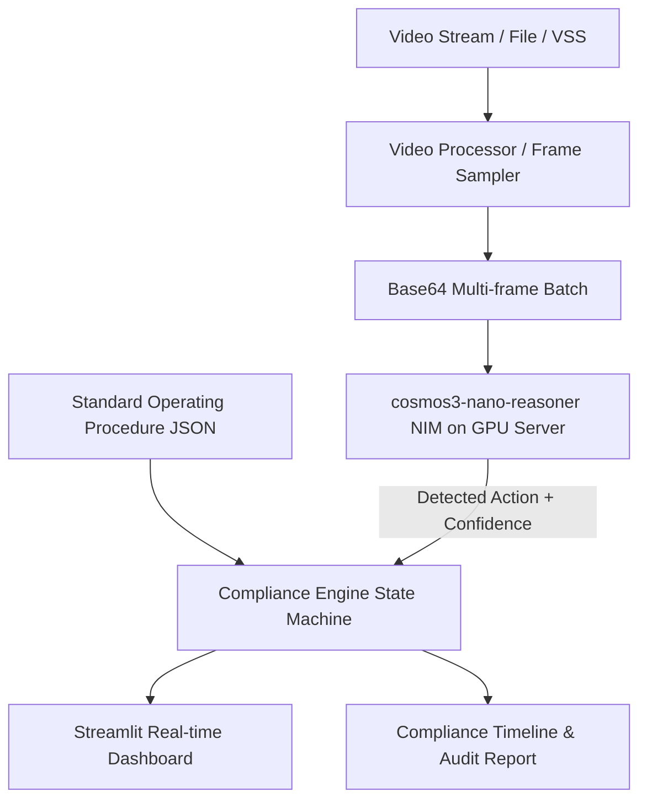

# Architecture: Visual Compliance Inspector

## System Components

### 1. Ingestion & Pre-processing (`src/video_processor.py`)
- Ingests video from local file (`.mp4`), remote stream, or VSS (Video Storage Server).
- Samples frames at configurable FPS (e.g., 0.5 to 2.0 FPS) to balance token payload and temporal fidelity.
- Resizes and encodes frame batches to Base64.

### 2. Temporal Reasoning Engine (`src/nim_client.py`)
- Target Model: `cosmos3-nano-reasoner`.
- Hosted on: Dedicated GPU server accessed via HTTP / OpenAI-compatible NIM endpoint (configured over SSH).
- Input: Frame sequences (representing short sliding temporal windows) + prompt listing expected SOP steps.
- Output: Identified action, action boundaries, or transition state (`None`).

### 3. Compliance State Machine (`src/compliance_engine.py`)
- Input: SOP JSON definitions (ordered sequence of requirements).
- State per step: `Pending` -> `In Progress` -> `Completed` or `Missed`.
- Temporal Rules:
  - Progression tracking: If step $N+k$ is observed before step $N$, mark step $N$ as `Missed` (or flag out-of-order violation).
  - Timing registration: Records `timestamp_start` and `timestamp_end` in seconds.

### 4. Presentation & Visualization (`app.py`)
- Built with Streamlit.
- Displays video playback synchronized with procedure checklist.
- Highlights status with visual badges (Green: Completed, Orange: In Progress, Red: Missed/Violation).
