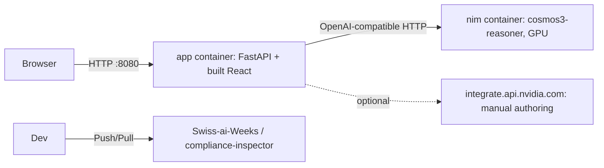

# Deployment & Infrastructure

## Topology



## Containers (`docker-compose.yml`)

| Service | Image | Needs |
| --- | --- | --- |
| `app` | built from `Dockerfile` (Node build stage, then python:3.10-slim) | no GPU; `outputs` volume |
| `nim` | `nvcr.io/nim/nvidia/cosmos3-reasoner:1.7.0`, `NIM_MODEL_SIZE=nano` | GPU (~34 GB+), `NGC_API_KEY` |

```bash
export NGC_API_KEY='nvapi-...'
export AUTHOR_API_KEY='nvapi-...'   # optional, for reading new manuals well
docker compose up -d                # app on http://localhost:8080
```

If a NIM is already running on the host (as on the Brev box), do not start a second one: the GPU
is full. Run only the app and point it at the existing NIM:

```bash
docker build -t compliance-inspector .
docker run -d --network host -e NIM_BASE_URL=http://127.0.0.1:8000/v1 compliance-inspector
```

No GPU at all: set `NIM_BASE_URL=https://integrate.api.nvidia.com/v1` and `NIM_API_KEY`, and drop
the `nim` service. NIM setup in detail: [`docs/brev-nim-deployment.md`](../../docs/brev-nim-deployment.md).

## Configuration (environment)

| Variable | Default | Meaning |
| --- | --- | --- |
| `NIM_BASE_URL`, `NIM_MODEL`, `NIM_API_KEY` | local NIM, `nvidia/cosmos3-nano-reasoner` | the video model. The `nvidia/` prefix matters |
| `AUTHOR_API_KEY`, `AUTHOR_BASE_URL`, `AUTHOR_MODEL` | unset, hosted NVIDIA API | manual reader; falls back to the video model without a key |
| `DETECT_MODE` | `grid` | `grid` (clips x steps) or `choice` (one call per clip) |
| `CHUNK_SECONDS`, `CHUNK_OVERLAP` | 10, 2 | clip length; sets timestamp resolution (~8 s) |
| `IDLE_SCORE`, `SKIP_PENALTY`, `MIN_STEP_SCORE`, `OUT_OF_ORDER_SCORE` | 4, 6, 5, 8 | alignment and status thresholds |
| `OUTPUTS_DIR`, `PRODUCTS_DIR` | `outputs/`, `products/` | job state and demo data |

## Local development

```bash
.venv/bin/pip install -r backend/requirements.txt
.venv/bin/uvicorn backend.main:app --port 8080     # API, and the built UI if backend/static exists
cd frontend && npm install && npm run dev          # UI on :5173, proxies /api to :8080
npm run build                                      # emits into backend/static
```

Node 20+ is required for Vite; Ubuntu 22.04's apt only has Node 12, so install from NodeSource.

## Demo data

`products/<name>/` holds `product.json`, `sop.json`, `manual.pdf` and optional
`ground_truth/<video>.json`. Videos (`*.mp4`) are gitignored: a fresh clone lists no demos until
`products/<name>/videos/<id>.mp4` is added. Source: IKEA-Manuals-at-Work.
