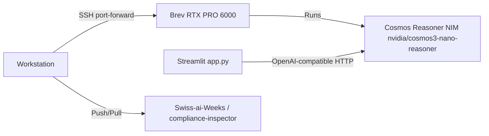

# Deployment & Infrastructure

## Infrastructure Topology



## Components

### 1. GPU host — Cosmos Reasoner NIM
- **Role**: multimodal inference for temporal action recognition.
- **Image**: `nvcr.io/nim/nvidia/cosmos3-reasoner:latest`, size selected with
  `NIM_MODEL_SIZE=nano` (~34 GB VRAM, BF16).
- **Model id**: `nvidia/cosmos3-nano-reasoner` — the `nvidia/` prefix matters.
- **Endpoint**: OpenAI-compatible at `/v1`, readiness at `/v1/health/ready`.
- **Full procedure**: [`docs/brev-nim-deployment.md`](../../docs/brev-nim-deployment.md).

### 2. Streamlit app
- **Runtime**: Python 3.10+, OpenCV, Streamlit, OpenAI SDK (`requirements.txt`).
- **Config**: `NIM_BASE_URL`, `NIM_MODEL`, `NIM_API_KEY` — see `.env.example`.
  These must be **exported into the shell**; the app does not call
  `load_dotenv()`.
- **Data**: test videos in `videos/` (gitignored); sourced from the Stanford
  Digital Repository per IKEA-Manuals-at-Work.

## Quick start

```bash
export NGC_API_KEY='nvapi-...'
# ... deploy the NIM per docs/brev-nim-deployment.md ...

export NIM_BASE_URL=http://localhost:8000/v1
export NIM_MODEL=nvidia/cosmos3-nano-reasoner
export NIM_API_KEY=not-needed
streamlit run app.py
```
