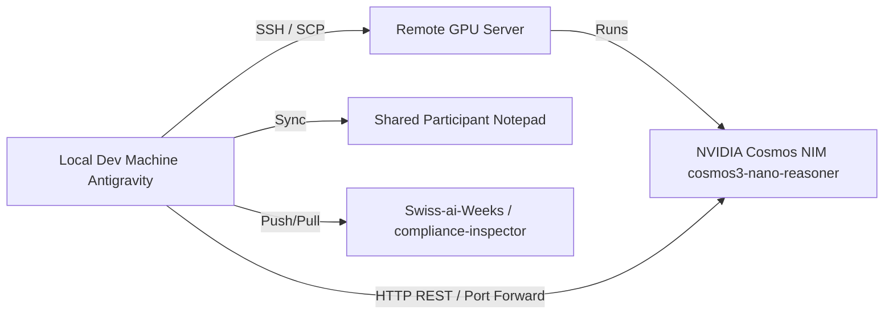

# Deployment & Infrastructure

## Infrastructure Topology



## Environments & Connectivity

### 1. Remote GPU Server
- **Role**: Model inference host.
- **Model**: `cosmos3-nano-reasoner`.
- **Access**: Configured via SSH tunnel / key-based auth.
- **Endpoint**: NIM exposed locally or via forwarded port (e.g. `http://localhost:8000/v1` or remote IP).

### 2. Local Workstation
- **OS**: Windows (Antigravity environment).
- **Runtime**: Python 3.10+, OpenCV, Streamlit, OpenAI SDK.
- **Data**: Local test videos in `video_ikea/`.

### 3. Collaboration & Coordination
- **Shared Notepad**: Live coordination document shared with other hackathon participants (containing shared endpoints, credentials, notes).
- **VSS Integration**: Video Storage Server endpoints for streaming footage directly if needed.

## Setup Procedure
1. Establish SSH tunnel to GPU server if port is not public:
   ```bash
   ssh -L 8000:localhost:8000 user@gpu-server
   ```
2. Set environment variables on local machine:
   ```powershell
   $env:NIM_BASE_URL="http://localhost:8000/v1"
   $env:NIM_MODEL="cosmos3-nano-reasoner"
   $env:NIM_API_KEY="your-key-or-token"
   ```
3. Run local UI:
   ```powershell
   streamlit run app.py
   ```
