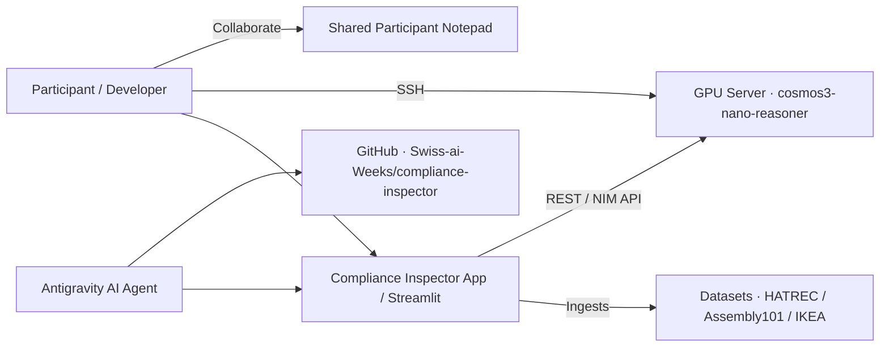

# Ecosystem

## Entities
- **Local Application**: Streamlit dashboard + video processing + compliance engine.
- **GPU Server**: Hosts the `cosmos3-nano-reasoner` container / NIM.
- **Shared Notepad**: Collaboration point between hackathon participants.
- **GitHub Upstream**: `https://github.com/Swiss-ai-Weeks/compliance-inspector`.
- **Reference Datasets**: HATREC, Assembly101, IKEA Manuals at Work.
