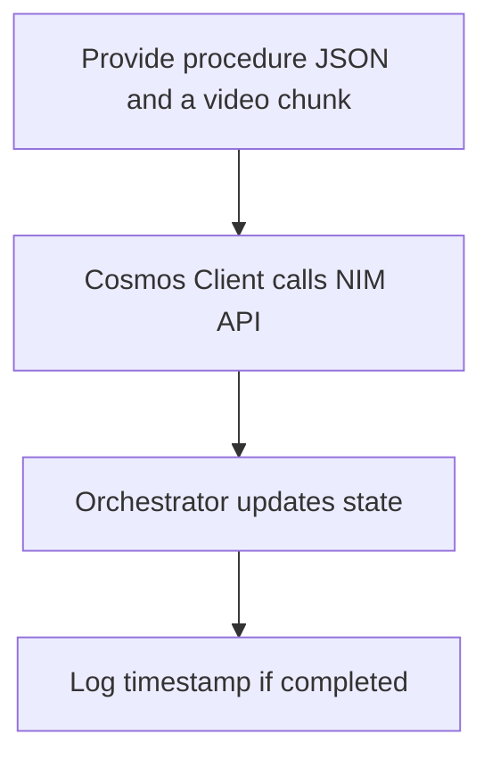
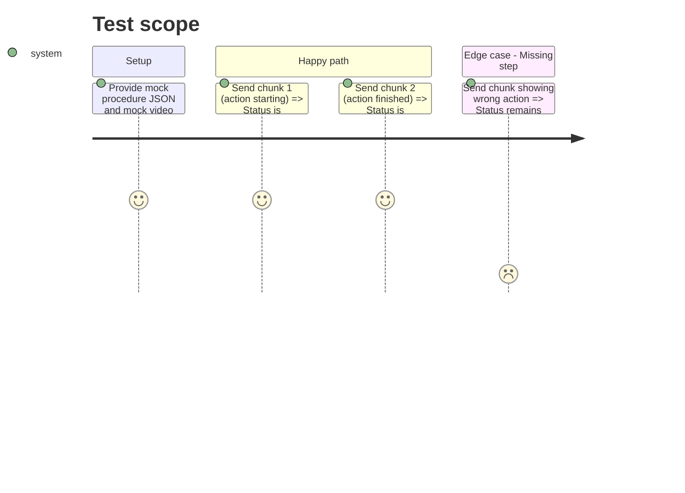

# Instruction: Core Engine & Cosmos Integration

## Architecture projection

> Tree of the final files. ✅ create · ✏️ modify · ❌ delete

```txt
.
├── src/
│   ├── ✅ orchestrator.py
│   ├── ✅ cosmos_client.py
│   └── ✅ models.py
└── ✅ requirements.txt
```

## User Journey



## Test Scope



## Tasks to do

### `1)` Setup data models

> Define the procedure and state schema.

1. Create `models.py` with Pydantic classes for `ProcedureStep` and `State`.
2. Include states for PENDING, IN_PROGRESS, COMPLETED, MISSED, IDLE, TRANSITION, and OUT_OF_BOUNDS.

### `2)` Implement Cosmos Client

> Wrap the NVIDIA Cosmos NIM API.

1. Create `cosmos_client.py` with a function to send a short video chunk.
2. Implement a multi-choice prompt that injects **temporal context** (e.g., "The previous step [Name] was just completed.").
3. Allow Cosmos to classify the chunk into: active steps (A, B, C), IDLE/Pause (D), TRANSITION (E), or Unknown Action (F).
4. **Hackathon Strategy (Output Parser)**: 
   - *MVP*: Use basic Python parsing (`Regex` or `Pydantic`) to extract the exact letter (A-F) from the LLM's response.
   - *Bonus*: Integrate **NVIDIA NeMo Guardrails** as a wrapper to strictly enforce the output format and prevent conversational hallucinations from crashing the orchestrator.

### `3)` Build the State Machine Orchestrator

> Track the progression of steps and handle edge cases.

1. Create `orchestrator.py` that defaults to a **Standard Mode** (querying the next 3 steps).
2. If Cosmos returns IDLE or TRANSITION, skip the chunk and wait (absorbs overlaps naturally).
3. If Cosmos returns Unknown Action (F), trigger **Recovery Mode**: loop through all remaining steps in batches of 3 **in strict chronological order starting from the current cursor**. Stop at the **first match** (Proximity Rule) to disambiguate repeated actions, log a sequence `Warning`, and update the current cursor.
4. Record timestamps for all state changes.

## Test acceptance criteria

| Task | Acceptance criteria              |
| ---- | -------------------------------- |
| 1    | `models.py` defines schemas for step tracking and state enums. |
| 2    | `cosmos_client.py` successfully returns mocked or real NIM API responses (YES/NO/IN_PROGRESS). |
| 3    | `orchestrator.py` transitions state correctly across multiple chunks for a given step. |
