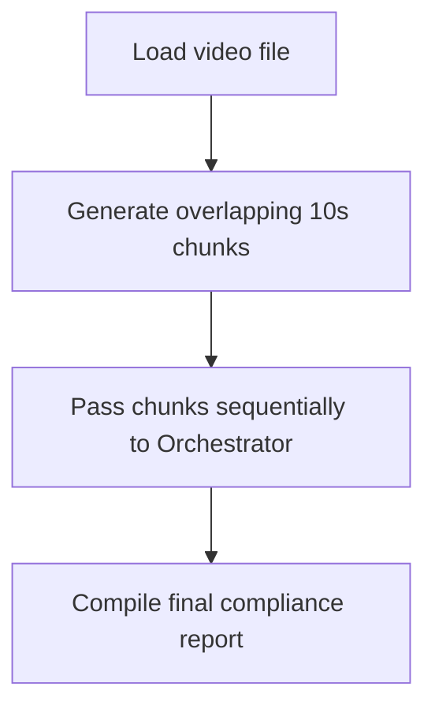
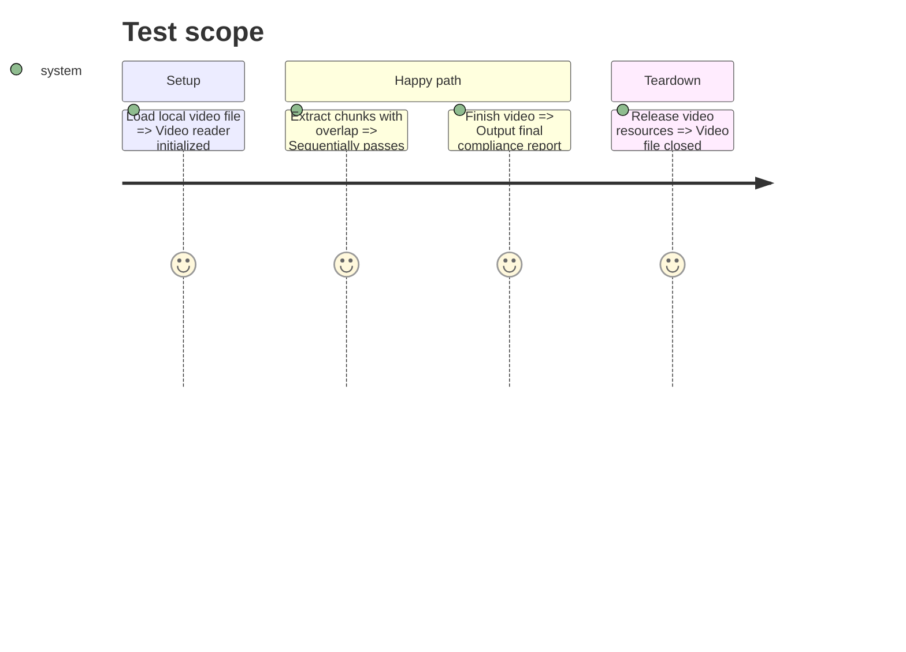

# Instruction: Video Pipeline & Sliding Window

## Architecture projection

> Tree of the final files. ✅ create · ✏️ modify · ❌ delete

```txt
.
├── src/
│   ├── ✅ video_processor.py
│   └── ✏️ orchestrator.py
└── data/
    └── ✅ sample_video.mp4
```

## User Journey



## Test Scope



## Tasks to do

### `1)` Implement Video Chunking

> Use OpenCV/VSS to slice the video.

1. Create `video_processor.py` to read an mp4 file.
2. Implement a generator that yields overlapping video chunks (e.g., 0-10s, 5-15s, 10-20s) as temporary files or byte streams.

### `2)` Integrate with Orchestrator (Async & Resilient)

> Feed the chunks into the engine without losing data.

1. Modify `orchestrator.py` to pull video chunks from an **asynchronous queue (buffer)** rather than a blocking loop.
2. Call the Cosmos Client for the active step.
3. **Retry Logic**: If the Cosmos API fails (timeout or 500 error), the orchestrator must *retry* the chunk (with a short delay) instead of dropping it, ensuring complete traceability.
4. Generate a final compliance summary when the video ends.

## Test acceptance criteria

| Task | Acceptance criteria              |
| ---- | -------------------------------- |
| 1    | `video_processor.py` successfully generates overlapping chunks of a specified duration. |
| 2    | The system processes an entire video end-to-end and outputs a final compliance report. |
