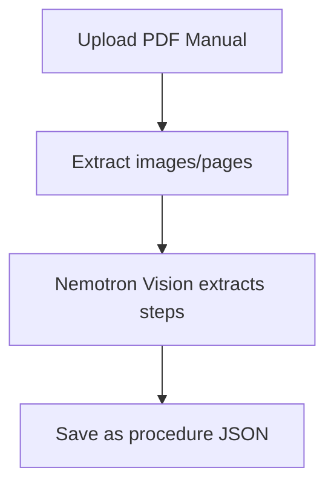
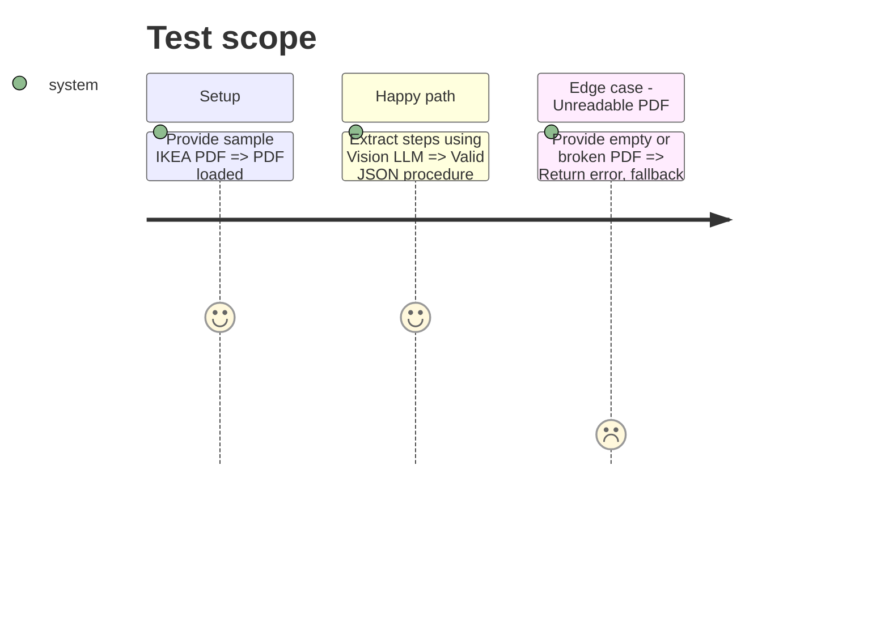

# Instruction: PDF Procedure Extractor

## Architecture projection

> Tree of the final files. ✅ create · ✏️ modify · ❌ delete

```txt
.
├── src/
│   ├── ✅ pdf_extractor.py
│   └── ✏️ requirements.txt
└── data/
    └── ✅ manual.pdf
```

## User Journey



## Test Scope



## Tasks to do

### `1)` Extract PDF Content

> Convert PDF pages to images.

1. Create `pdf_extractor.py` using `pdf2image` or `PyMuPDF` to convert pages to images.
2. Add necessary dependencies to `requirements.txt`.

### `2)` Implement Nemotron Vision Client

> Generate JSON from images.

1. Send the extracted page images to NVIDIA Nemotron Vision API.
2. Prompt the API to extract sequential assembly steps into the structured JSON format required by `models.py`.
3. **Enterprise SOP Rule**: Enforce the prompt to generate *unique, visually contextualized descriptions* for repeated actions (e.g., "Screw the FIRST leg (front-left)" instead of just "Screw leg") to help the Video AI disambiguate steps.
4. **Auto-Correction Pass**: Pass the generated JSON to a text LLM (NVIDIA NeMo). If duplicate descriptions are detected, the LLM must automatically rewrite them to be sequentially distinct before saving.
5. Save the resulting JSON file to `data/`.

## Test acceptance criteria

| Task | Acceptance criteria              |
| ---- | -------------------------------- |
| 1    | PDF is successfully converted to a series of images. |
| 2    | Nemotron API returns a well-formed JSON list of steps matching the `models.py` schema. |
