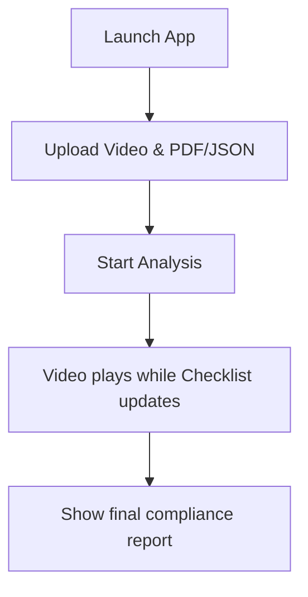
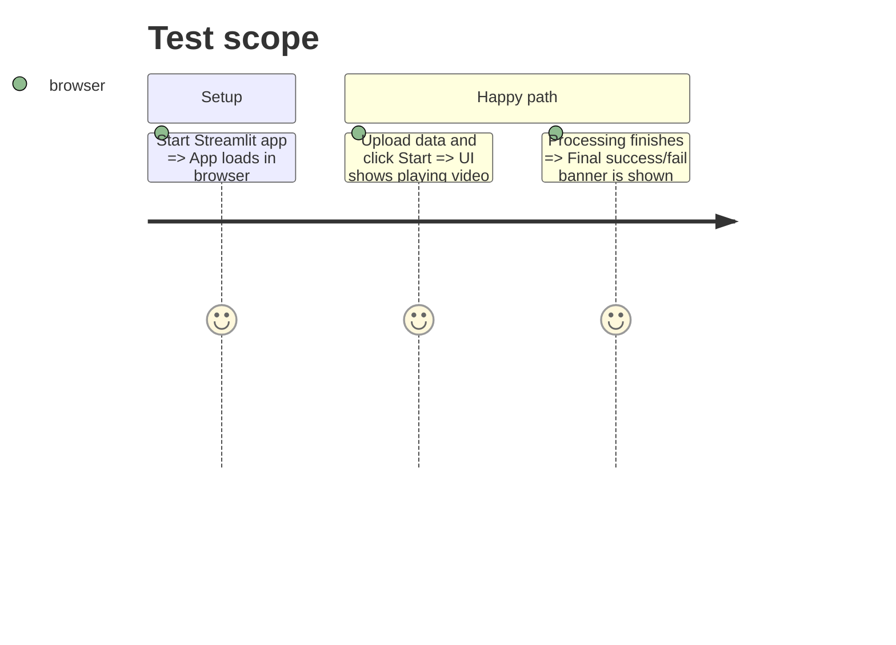

# Instruction: Demo App (Split-screen UI)

## Architecture projection

> Tree of the final files. ✅ create · ✏️ modify · ❌ delete

```txt
.
├── src/
│   ├── ✅ app.py
│   └── ✏️ requirements.txt
```

## User Journey



## Test Scope



## Wireframe

```txt
+-------------------------------------------------------------+
| 1. Visual Compliance Inspector (Header)                     |
+-------------------------------------------------------------+
| 2. Sidebar        | 3. Main Content                         |
| [Upload Video]    | +-------------------+ +---------------+ |
| [Upload PDF/JSON] | |                   | | 4. Checklist  | |
|                   | |                   | | [x] Step 1    | |
| [Start Analysis]  | |   Video Player    | | [ ] Step 2    | |
|                   | |                   | | [ ] Step 3    | |
|                   | +-------------------+ +---------------+ |
|                   | 5. Logs: "Step 1 completed at 00:15"    |
+-------------------------------------------------------------+
```
Notes:
1. Header with title.
2. Sidebar for inputs and controls.
3. Split view showing the video playback.
4. Dynamic checklist showing the real-time status of the procedure.
5. Log area for detailed timestamps and alerts.

## Tasks to do

### `1)` Setup Streamlit UI

> Create the basic layout.

1. Create `app.py` using Streamlit.
2. Implement the sidebar for file uploads (Video + JSON/PDF).
3. Create the split columns for the video player and the checklist.

### `2)` Wire the Engine via API

> Connect the UI to the Backend.

1. Connect `app.py` to the FastAPI backend using the `requests` library (e.g., `POST /api/analyze`).
2. Implement polling or websockets to receive chunk updates and update the checklist UI and log area in real-time.
3. Display the final compliance verdict.

## Test acceptance criteria

| Task | Acceptance criteria              |
| ---- | -------------------------------- |
| 1    | Streamlit app renders the specified wireframe layout without errors. |
| 2    | The checklist updates correctly in the UI as the backend processes the video. |
