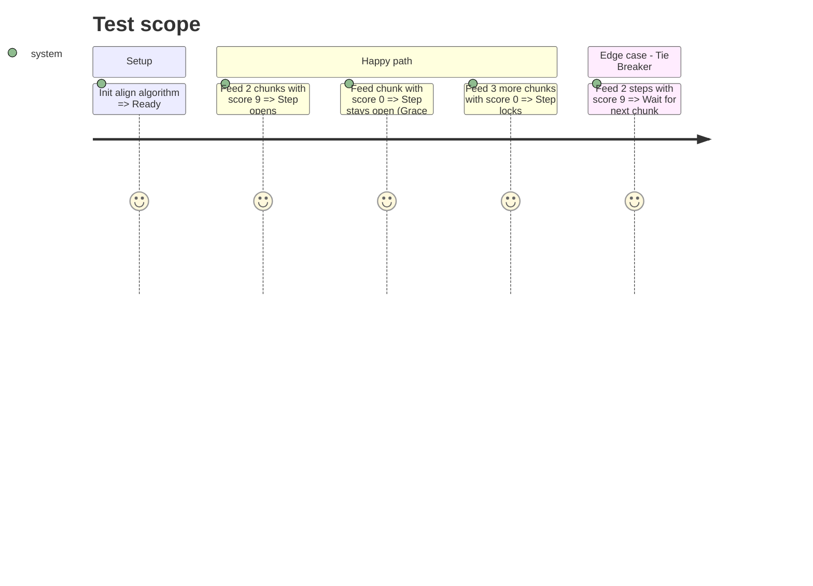

# Instruction: Phase 1 - Greedy Logic

## Architecture projection

> Tree of the final files. + create . modify - delete

```txt
.
+ aidd_docs/tasks/2026_09/2026_09_20_greedy_align/phase-1.md
. backend/align.py
```

## User Journey

```mermaid
flowchart TD
  A[System reads AI scores row by row] --> B{Score >= 5.0 for 2 chunks?}
  B -- Yes --> C[Open Step (In Progress)]
  C --> D{Score drops to 0}
  D --> E[Start Grace Period]
  E -- Expires --> F[Lock Step]
  E -- Signal Returns --> C
```

## Test Scope



## Tasks to do

### 1) Write greedy_align function
> Add the algorithm to align.py

1. Open `backend/align.py`.
2. Create `greedy_align(scores, chunks, step_ids, patience=2)` returning `list[StepSpan]`.
3. Implement row-by-row iteration with active_step, patience_counter, and locked_steps set.
4. Implement opening logic: 2 consecutive chunks >= MIN_STEP_SCORE.
5. Implement closing logic: grace period expires or new step triggers.
6. Implement tie-breaker: inertia > suspension.

## Test acceptance criteria

| Task | Acceptance criteria |
| ---- | ------------------- |
| 1 | The greedy_align function correctly identifies step spans and locks them without crashing on ties or noise. |
