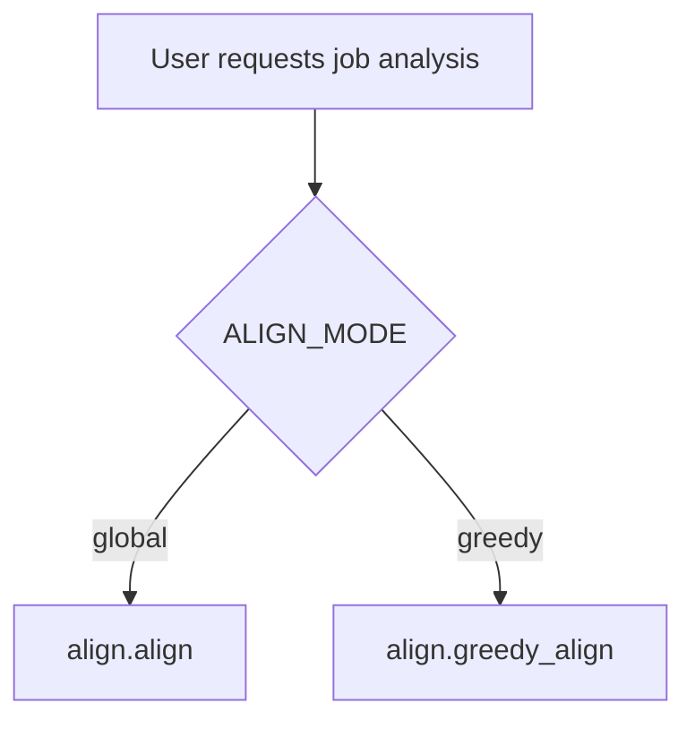
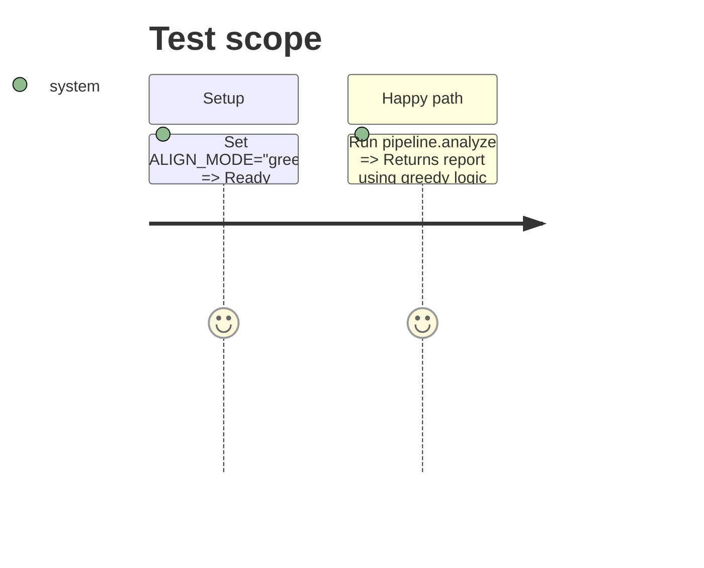

# Instruction: Phase 2 - Integration

## Architecture projection

> Tree of the final files. + create . modify - delete

```txt
.
+ aidd_docs/tasks/2026_09/2026_09_20_greedy_align/phase-2.md
. backend/config.py
. backend/pipeline.py
```

## User Journey



## Test Scope



## Tasks to do

### 1) Add config variable
> Allow switching between global and greedy alignment.

1. Open `backend/config.py`.
2. Add `ALIGN_MODE = os.environ.get("ALIGN_MODE", "global")`.

### 2) Integrate into pipeline
> Update the analyzer to respect the config.

1. Open `backend/pipeline.py`.
2. In `analyze`, check `config.ALIGN_MODE`.
3. If "greedy", call `align.greedy_align(scores, chunks, [s["step_id"] for s in steps])`.
4. Otherwise, call `align.align(...)`.

## Test acceptance criteria

| Task | Acceptance criteria |
| ---- | ------------------- |
| 1 | ALIGN_MODE can be set via environment variable. |
| 2 | pipeline.py seamlessly routes data to greedy_align when configured. |
